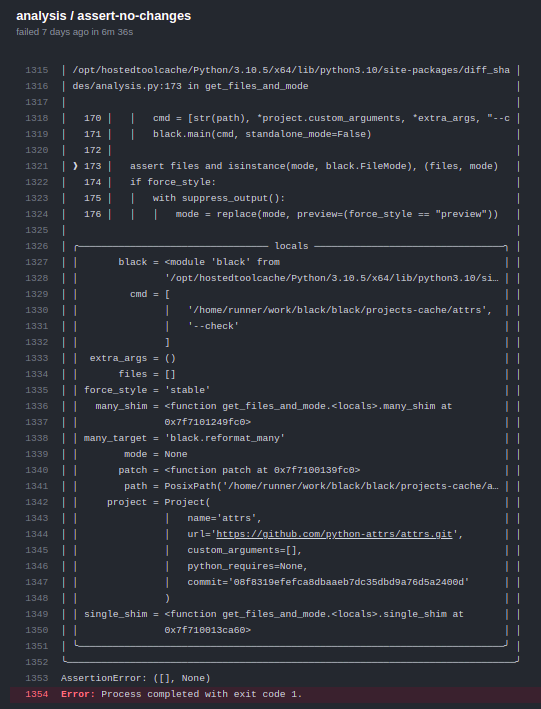
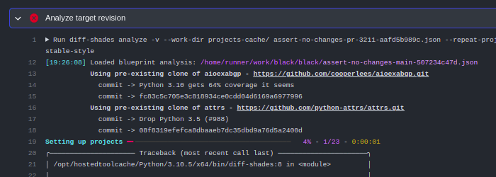

This is a follow-up post for my "*Compiling Black with mypyc*" series. If you missed it,
[you can read part one here](../compiling-black-with-mypyc-part-1/).

## Time flies!

It has been over *eight months* since Black started to ship the mypyc compiled wheels.

### Rewriting the mypyc build workflow

All of this work is actually why I chose to cancel release 22.7.0 and instead delay it
until August (becoming 22.8.0). I simply didn't get the new workflow to a state where I
was comfortable enough to deploy it in time for a July release.

### Debugging a frustrating lazy import bug caused by mypyc

*Note: I wrote this section right after I finished debugging this issue, so my frustration
will be rather unfiltered here.*

#### Background

As part of working towards [release 22.8.0][22.8.0-milestone] of Black, I filed a PR
([black#3211] [^1] [^2]) to delay the imports of `multiprocessing`, `asyncio` and friends
until they're truly necessary. For context, Black will use multiprocessing (and quite a
few other modules) when there's more than just one file to format. This is good for
performance in general, *but* in the common case where you're simply formatting a single
file, there is no reason to spend time importing these useless modules.

I expected this PR to be an easy one to land, but to my surprise CI failed ... and not the
regular test suite jobs, no, [the diff-shades jobs][diff-shades-ci-fail-summary].

> In essence, [diff-shades] is a tool that clones a bunch of projects, runs Black on ‘em
> while recording the results. It also comes with commands to analyze and compare
> recordings.
>
> We primarily use it in CI to see how PRs will impact real users of Black before merging
> them. If you're curious for more,
> [you can read these docs][diff-shades-integration-docs].

#### Initial investigation

diff-shades interfaces with Black in some, uh, *questionable* ways. Not only am I using
the internal API even though you really shouldn't do that, but I *also*
[monkeypatch `black.reformat_many` and `black.reformat_one` with shims at runtime][monkeypatching-shenanigans].[^3]
I'm not going to explain why here, but feel free to read the footnote.

In that PR, I moved `black.reformat_many` to `black.concurrency.reformat_many` so I can
delay ("lazify") the imports of the modules it needs wholesale by delaying ("lazifying")
the import of `black.concurrency` itself.

Somehow, this broke diff-shades which shouldn't have been the case as
[I patched diff-shades to check whether `black.reformat_many` exists or not][diff-shades-pr-patch]
before monkeypatching it with shims. If it doesn't exist, then diff-shades will try
patching `black.concurrency.reformat_many` instead.



This traceback is a lot to take in, so I'll quickly summarize the important bits:

- The crash is actually an `AssertionError`. The failing assert checks that the `files`
  and `mode` local variables have been updated by the shims.
  - In this case, they have not which means the monkeypatching didn't work for some
    reason.
- The `unittest.mock.patch` call replacing `reformat_many` should've patched
  `black.concurrency.reformat_many` with the many shim thanks to the change I made to
  diff-shades earlier
  - But in the traceback we can see that `many_target` (the qualifed name being patched)
    is `black.reformat_many` which shouldn't even exist anymore!

Confusingly, patching a name that doesn't exist *should* fail, but somehow it wasn't
blowing up. Even more confusing at the time, things only broke while setting up the
*second* project, not the first!



*(This should've been a clue that some funky import shenanigans were taking place, but I
didn't realize that until much later.)*

#### Further investigation

Since I couldn't make sense of the issue staring at the CI logs, I next tried to reproduce
the issue locally, which was also a nightmare. A simple diff-shades run on a checkout of
the PR ran normally:

```console
~/programming/testing/black on reduce-single-file-format-overhead [?⇡] via v3.8.5 (venv)
$ diff-shades analyze /dev/null --work-dir ../black-mypyc/projects-cache/
Setting up projects ━━━━━━━━━━━━━━━━━━━━━━━━━━━━━━━━━━━━━━━━ 100% - 23/23 - 0:00:08
[13:38:00] aioexabgp finished as nothing-changed
Running black ━━━━━━━━━━━━━━━━━━━━━━━━━━━━━━━━━━━━━━━━   0% - 30/10390 - 0:00:04
╰─> attrs     ━━━━━━╸━━━━━━━━━━━━━━━━━━━━━━━━━━━━━━━━━  17% - 10/58    - 0:00:02

[Control-C-ed since project setup passed and running black takes too
long on the full project suite]
```

"OK, fine I'll compile Black with mypyc just like CI," I thought. "Also, let's just use
attrs since it's the project failing."

```console
$ pip install -r .github/mypyc-requirements.txt
$ CC=clang && python setup.py --use-mypyc bdist_wheel
$ pip install dist/*.whl

$ diff-shades analyze /dev/null -v --work-dir ../black-mypyc/projects-cache/ --select attrs
[14:09:15] Using pre-existing clone of attrs - https://github.com/python-attrs/attrs.git
             commit ->  pre-commit autoupdate (#990)
             commit -> 107367d437484006a7d01854e91e478401690087
Setting up projects ━━━━━━━━━━━━━━━━━━━━━━━━━━━━━━━━━━━━━━━━ 100% - 1/1 - 0:00:00
[13:50:05] attrs finished as nothing-changed
Running black ━━━━━━━━━━━━━━━━━━━━━━━━━━━━━━━━━━━━━━━━ 100% - 58/58 - 0:00:08

╭───────────────────────────── Summary ──────────────────────────────╮
│         File breakdown                   Project breakdown         │
│  Result            # of files     Result            # of projects  │
│ ──────────────────────────────   ───────────────────────────────── │
│  nothing-changed   58             nothing-changed   1              │
│  reformatted       0              reformatted       0              │
│  failed            0              failed            0              │
│                                                                    │
│ # of lines: 16 631                                                 │
│ # of files: 58                                  0 changes in total │
│ # of projects: 1                         0 additions - 0 deletions │
╰────── black 22.6.1.dev33+g87e279b - Aug 12 2022 17:50:06 UTC ──────╯
```

Still works fine ... "quick sanity check, does `black.reformat_many` even work in the
Python REPL?"

```pycon
>>> import black
>>> black.reformat_many
Traceback (most recent call last):
  File "<stdin>", line 1, in <module>
AttributeError: module 'black' has no attribute 'reformat_many'
```

"Hmm, maybe it only crashes using a specific revision of attrs," I thought (this is
stupid, but look I was desperate!)

```console { hl_lines=[6, 7] }
# [insert shenanigans in projects-cache/ to update the attrs repository
# to same commit used in CI ...]

$ diff-shades analyze  /dev/null -v --work-dir cache/ --select attrs
[14:10:40] Using pre-existing clone of attrs - https://github.com/python-attrs/attrs.git
             commit -> Drop Python 3.5 (#988)
             commit -> 08f8319efefca8dbaaeb7dc35dbd9a76d5a2400d
Setting up projects ━━━━━━━━━━━━━━━━━━━━━━━━━━━━━━━━━━━━━━━━ 100% - 1/1 - 0:00:00
[14:10:50] attrs finished as nothing-changed
Running black ━━━━━━━━━━━━━━━━━━━━━━━━━━━━━━━━━━━━━━━━ 100% - 58/58 - 0:00:09

╭───────────────────────────── Summary ──────────────────────────────╮
│         File breakdown                   Project breakdown         │
│  Result            # of files     Result            # of projects  │
│ ──────────────────────────────   ───────────────────────────────── │
│  nothing-changed   58             nothing-changed   1              │
│  reformatted       0              reformatted       0              │
│  failed            0              failed            0              │
│                                                                    │
│ # of lines: 16 498                                                 │
│ # of files: 58                                  0 changes in total │
│ # of projects: 1                         0 additions - 0 deletions │
╰────── black 22.6.1.dev33+g87e279b - Aug 12 2022 18:10:50 UTC ──────╯
```

Nope.

I tried quite a few more things, but explaining them would require more explaining into
how diff-shades works, to which I am not doing :)

Eventually I decided to try analyzing two projects, specifically `aioexabgp` and `attrs`
as they led to the crash in CI.

```console
❯ diff-shades analyze /dev/null -v --work-dir cache/-s attrs -s aioexabgp
[14:19:30] Using pre-existing clone of aioexabgp - https://github.com/cooperlees/aioexabgp.git
             commit -> Python 3.10 gets 64% coverage it seems
             commit -> fc83c5c705e3c818934ce0cdd04d6169a6977996
           Using pre-existing clone of attrs - https://github.com/python-attrs/attrs.git
             commit -> Drop Python 3.5 (#988)
             commit -> 08f8319efefca8dbaaeb7dc35dbd9a76d5a2400d
Setting up projects ━━━━━━━━━━━━━━━━━━━━╺━━━━━━━━━━━━━━━━━━━  50% - 1/2 - 0:00:00
╭─────────────────────────────── Traceback (most recent call last) ────────────────────────────────╮
│                                                                                                  │
| [traceback snipped for brevity]                                                                  |
│                                                                                                  │
│ /home/ichard26/programming/testing/black/venv/lib/python3.8/site-packages/diff_shades/analysis.p │
│ y:173 in get_files_and_mode                                                                      │
│                                                                                                  │
│   170 │   │   cmd = [str(path), *project.custom_arguments, *extra_args, "--check"]               │
│   171 │   │   black.main(cmd, standalone_mode=False)                                             │
│   172 │                                                                                          │
│ ❱ 173 │   assert files and isinstance(mode, black.FileMode), (files, mode)                       │
│   174 │   if force_style:                                                                        │
│   175 │   │   with suppress_output():                                                            │
│   176 │   │   │   mode = replace(mode, preview=(force_style == "preview"))                       │
╰──────────────────────────────────────────────────────────────────────────────────────────────────╯
AssertionError: ([], None)
```

Finally. I can now investigate the root cause why CI is crashing.

Adding calls to log the shim target and whether `black.reformat_many` exists to the shim
logic clearly shows what's wrong.

```console
❯ diff-shades --show-locals analyze /dev/null -s attrs -s aioexabgp -w ../cache/ -v
[19:21:29] Using pre-existing clone of aioexabgp - https://github.com/cooperlees/aioexabgp.git
             commit -> Format with black 21.4b0
             commit -> 434afb751a8e46eab6b1c67d902bf8352408372b
           many_target='black.concurrency.reformat_many'
           hasattr(black, 'reformat_many')=False
           Using pre-existing clone of attrs - https://github.com/python-attrs/attrs.git
             commit -> Fix typo
             commit -> 5c78fbc1547e18ace227085600f1fc11090e072a
           many_target='black.reformat_many'
           hasattr(black, 'reformat_many')=True
Setting up projects ━━━━━━━━━━━━━━━━━━━━╺━━━━━━━━━━━━━━━━━━━  50% - 1/2 - 0:00:02
```

The set up process for the first project, `aioexabgp`, behaves as expected, but when
setting up the second project, all of sudden `black.reformat_many` now exists. It's
actually pointing to the shim setting up the first project added.

```console
❯ diff-shades --show-locals analyze /dev/null -s attrs -s aioexabgp -w ../cache/ -v
[19:26:09] Using pre-existing clone of aioexabgp - https://github.com/cooperlees/aioexabgp.git
             commit -> Format with black 21.4b0
             commit -> 434afb751a8e46eab6b1c67d902bf8352408372b
           many_target='black.concurrency.reformat_many'
           getattr(black, 'reformat_many', None)=None
           Using pre-existing clone of attrs - https://github.com/python-attrs/attrs.git
             commit -> Fix typo
             commit -> 5c78fbc1547e18ace227085600f1fc11090e072a
           many_target='black.reformat_many'
           getattr(black, 'reformat_many', None)=<function get_files_and_mode.<locals>.many_shim at 0x7fdc6c00af70>
Setting up projects ━━━━━━━━━━━━━━━━━━━━╺━━━━━━━━━━━━━━━━━━━  50% - 1/2 - 0:00:02
```

It took way longer than it should've, but eventually after staring at these logs and doing
some other debugging, it dawned on me that this is probably a mypyc bug.

#### Wrap-up

Searching the mypyc issue tracker for "import function" leads to [mypyc#787]... so yay? At
least this is known behaviour, but gosh do I wish I knew this *before* embarking on this
debugging trek.

I know, in hindsight, it's painfully obvious I should've checked whether interpreted Black
had the same weird behaviour, but to quote CGP Grey from
[Someone Dead Ruined My Life… Again.][cgp-reference]:

> But you only know at the end what is the fastest way from the beginning.

*Sigh*. mypyc, it still has some rough edges to be ironed out :)

About that actually ...

### Recent-ish bugfixes to mypyc

### What's next going forward?

A few months ago I decided to learn some C. I chose C mostly because it's a natural next
step after Python given Python's strong connection to C (hi CPython). Also. I'd love to
write patches for mypyc down the road and knowing some C would be incredibly helpful.

______________________________________________________________________

## And finally, a few words on my mypyc series

My blog series on mypyc blew up.

I always knew there was an untapped interest in mypyc that was slowly growing over time,
but I could have never predicted just *how much* people wanted to learn more about mypyc.

I am really happy to all of the recent buzz about mypyc. For example, I have noticed an
uptick in how many times mypyc is mentioned during discussions on the Python Discord
server. I like to believe my series helped to kickstart some of this new interest :)

As always, if you have any questions, [feel free to ask them here][questions]! I'll try my
best to respond.

[^1]: The issue this PR fixes is actually part of the [22.7.0 milestone][22.7.0-milestone]
    because I had originally hoped to get it fixed by the end of July in time for a new
    release. Turns out none of that went to plan as I noted in
    [the mypyc build workflow rewrite portion of this post](#rewriting-the-mypyc-build-workflow).

[^2]: I know the PR's timeline has been taken over by "marked this pull request as draft"
    events. You can blame my terrible WiFi and GitHub's failure to make the "mark as
    draft" request idempotent for that :P Also, yes there is some review spam in true
    #OSSonGitHub fashion.

[^3]: diff-shades (almost always) interacts with Black directly via its internal APIs.
    Problem is that Black has no good APIs to get the files and project configuration (aka
    `black.Mode`) for a given source tree. All of the logic is tied up in `main` and a
    bunch of helper functions. diff-shades needs this information so it knows what files
    to pass to Black and also how to configure it. I could've copied Black's code that
    calcuates this sort of stuff, but
    [I chose to instead run `black.main` inline passing the project directory and then by replacing `black.reformat_one` and `black.reformat_many` with shims][monkeypatching-shenanigans],
    diff-shades yoinks the sources list and Mode object that would've been used to format
    the project.

[22.7.0-milestone]: https://github.com/psf/black/milestone/1
[22.8.0-milestone]: https://github.com/psf/black/milestone/3
[black#3211]: https://github.com/psf/black/pull/3211
[cgp-reference]: https://www.youtube.com/watch?v=qEV9qoup2mQ&t=1094s
[diff-shades]: https://github.com/ichard26/diff-shades
[diff-shades-ci-fail-summary]: https://github.com/psf/black/actions/runs/2805540896
[diff-shades-integration-docs]: https://black.readthedocs.io/en/latest/contributing/gauging_changes.html
[diff-shades-pr-patch]: https://github.com/ichard26/diff-shades/blob/f7bc7a3573e772c851aed65b2f5ea5287da68d0d/src/diff_shades/analysis.py#L161-L164
[monkeypatching-shenanigans]: https://github.com/ichard26/diff-shades/blob/f7bc7a3573e772c851aed65b2f5ea5287da68d0d/src/diff_shades/analysis.py#L137-L140
[mypyc#787]: https://github.com/mypyc/mypyc/issues/787
[questions]: https://github.com/ichard26/ichard26.github.io/discussions
