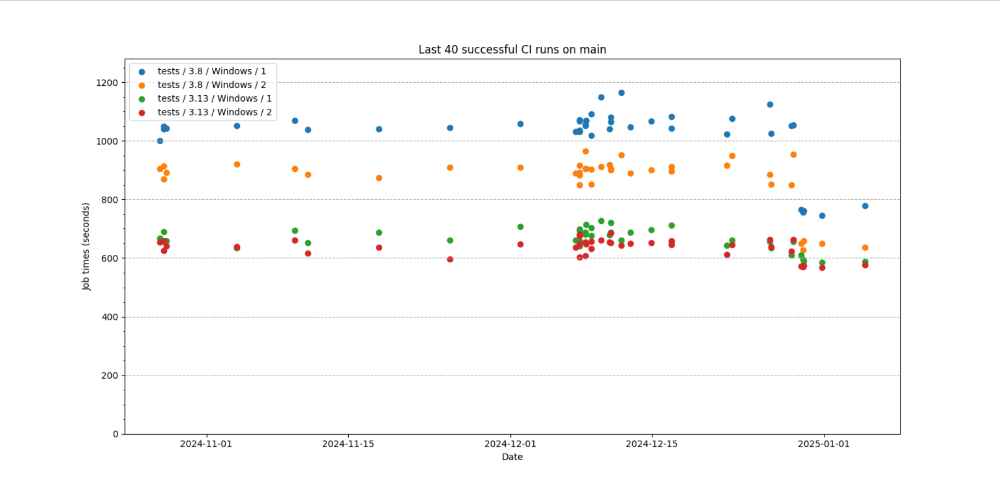

> [!conclusion] TL;DR
>
> If your GHA Windows jobs are I/O heavy, double check whether the I/O work is happening
> on the C: drive (OS) or D: drive (working space). If the C: drive is being used, you
> will likely benefit by **moving that work to the D: drive**. If you're feeling more
> adventurous, you should also **consider trying a ReFS/Dev Drive**.

A few weeks ago, I was waiting for pip's CI to turn 🍏 so I could merge a PR. I'd just
spent an hour on review and had pushed a few final tweaks. Waiting an additional 20
minutes was the last thing I wanted to do.[^spoiled]

I was sufficiently annoyed with checking and re-checking the CI status, so I enabled
[auto-merging on the repository] so I could at least focus my attention on something
entirely different while waiting for CI to pass. That smoothed over the pain, but it got
me wondering, can pip's tests (and CI in particular) be faster?

It turns out for the Windows CI jobs, the answer was: **yes, they could be _much_
faster.**

## How slow was pip's Windows CI?

At the time of writing[^writing], pip's Github Actions CI workflow consists of 28 jobs. 23
run the test suite across Ubuntu, macOS, Windows, and CPython 3.8 through 3.13.

- 7 on the `ubuntu-latest` runners
- 6 on the `macos-latest` (ARM) runners
- 6 on the `macos-13` (Intel) runners
- 4 on the `windows-latest` runners

The extra Ubuntu job runs the functional test suite against a [zipapp] version of pip.

On the other hand, the Windows jobs have historically been so slow that we don't even test
pip across the entire supported Python version matrix. We only test the oldest and newest
version, 3.8 and 3.13, on Windows. Plus, the test suite is
[sharded over two jobs per version] because—as you can probably guess—the Windows jobs are
that much slower 🐌.

I wrote a script that queries the GitHub API and calculates the average job duration over
the last X successful runs. As a baseline, this is what pip's CI looked like:

```text { hl_lines=[15, 17, 25, 27] }
                    Last 50 CI runs on main

  Job                            Mean    Minimum   Stdev
 ─────────────────────────────────────────────────────────────
  tests / 3.10 / macos-latest    6:25    5:44      0:34 (8%)
  tests / 3.11 / macos-latest    6:40    6:03      0:39 (9%)
  tests / 3.9 / macos-latest     6:57    6:03      0:55 (13%)
  tests / 3.13 / macos-latest    6:59    6:15      0:37 (8%)
  tests / 3.12 / macos-latest    7:09    6:14      1:01 (14%)
  tests / 3.8 / macos-latest     7:11    6:32      0:31 (7%)
  tests / 3.11 / ubuntu-latest   9:33    9:08      0:10 (1%)
  tests / 3.10 / ubuntu-latest   10:04   9:43      0:14 (2%)
  tests / 3.12 / ubuntu-latest   10:34   10:16     0:14 (2%)
  tests / 3.13 / ubuntu-latest   10:35   10:10     0:12 (2%)
  tests / 3.13 / Windows / 2     10:39   9:55      0:20 (3%)
  tests / 3.8 / ubuntu-latest    11:02   10:41     0:14 (2%)
  tests / 3.13 / Windows / 1     11:13   10:29     0:24 (3%)
  tests / 3.9 / ubuntu-latest    11:44   11:20     0:19 (2%)
  tests / 3.10 / macos-13        12:10   8:53      2:16 (18%)
  tests / 3.11 / macos-13        12:59   9:09      2:34 (19%)
  tests / 3.13 / macos-13        12:59   9:54      2:41 (20%)
  tests / 3.9 / macos-13         13:10   10:09     2:42 (20%)
  tests / 3.8 / macos-13         13:34   10:09     2:30 (18%)
  tests / 3.12 / macos-13        13:55   9:54      3:23 (24%)
  tests / 3.8 / Windows / 2      14:58   14:04     0:26 (2%)
  tests / zipapp                 16:53   16:27     0:15 (1%)
  tests / 3.8 / Windows / 1      17:37   16:40     0:30 (2%)
```

Among the slowest three jobs, the Windows 3.8 jobs hold the 3rd and 1st places for
duration. Yikes!

### Windows file I/O is poor on GitHub Actions

[**It's a known issue that file I/O on the Windows runners is noticeably slower**][slow-windows-io]
than the Ubuntu and macOS runners.

As a package installer, **pip's test suite is especially I/O heavy**. Most functional
tests require at least setting a scratch environment and installing something into it.
Countless files and directories are created, opened, and deleted during a run.

## Moving TEMP to the D: drive

[According to Steve Dower], the GHA Windows workers have a **slow** (but read-optimized)
**C: system drive and a faster D: drive for working space**.

> [!warning]
> Only the standard Windows runners have a D: drive. The larger (paid) Window
> runners do NOT have a D: drive. For such situations,
> [ReFS/Dev Drives should be considered](#what-about-refs-or-dev-drives).

For many projects, this is _probably_ fine. The repository is still checked out on the D:
drive. Any files you create in the checkout will be on the D: drive. For pip's test suite,
however, all of the temporary files are created under the system temporary directory.
Where is this path set to by default? On the C: drive at
`C:/Users/runneradmin/AppData/Local/Temp/`.[^we-set-it-explicitly]

Thus, pip's CI was being slowed down by reading and writing primarily to the
non-performant disk.

The good news is that this can be overridden by setting the `TEMP` environment variable
which Python's `tempfile` will respect.

```yaml
      - name: Set TEMP to D:/Temp
        run: |
          mkdir "D:\\Temp"
          echo "TEMP=D:\\Temp" >> $env:GITHUB_ENV
```

[This simple switch to `D:/Temp`][the-pr] translated into the Windows CI time **decreasing
by up to 30%**. 🎉

| Job             | Before  | After   | % decrease |
| --------------- | ------- | ------- | ---------- |
| Python 3.8 (1)  | 17m 37s | 12m 41s | 28%        |
| Python 3.8 (2)  | 14m 58s | 10m 44s | 28%        |
| Python 3.13 (1) | 11m 13s | 9m 53s  | 11%        |
| Python 3.13 (2) | 10m 39s | 9m 32s  | 10%        |

Or in graph form (**note**: the data shown here is slightly more recent than the
statistics).



## What about ReFS or Dev Drives?

When I was investigating ways to improve file I/O performance on Windows, I'd discovered
**[Dev Drives]**. Now, I am no Windows expert. I stopped using the OS on a daily basis
many years ago, but the TL;DR is they are a new kind of storage volume, built on the
modern ReFS (Resilient File System) filesystem and **designed with developer workloads in
mind**.

The
[uv project has had good success with using ReFS to speed up their Windows GHA jobs][uv],
thus I actually started with a ReFS drive[^unsupported] while optimising pip's Windows CI.
Unfortunately, using a ReFS drive
[was noticeably slower than simply moving `TEMP` to the D: drive][the-pr]. ReFS did save ~a
minute for `Python 3.8 (1)` but that pales in comparison with the nearly five minutes
improvement from `TEMP=D:/Temp`.

The performance improvements of ReFS/Dev Drives are primarily realized by **deferring
malware scans** (Dev Drive only) and the **inherent optimizations of the newer ReFS
filesystem**. Presumably the malware scans are already disabled on GitHub Actions, which
would explain why pip's CI did not see as big of an improvement as I was expecting.

Given uv's success with ReFS, I can't universally recommend using the D: drive over
ReFS/Dev Drives, and vice versa. **Which one will be faster is likely workload
dependent.** If you would like to experiment with ReFS/Dev Drives, my Powershell script to
[create such a drive can be found here][ps-script]. To invoke it, simply pass the desired
drive letter and volume size: `devdrive.ps1 -Drive R -Size 4GB`.

Happy experimenting!

[^spoiled]: Before you kill me for complaining, let me provide some context... When I used to
    maintain Black, I never really noticed how CI took. Most of the jobs would finish in
    3-6 minutes. Short enough that I could look over my changes one last time, add notes
    as comments, and then come back to merge. \
    \
    I did notice that Black's test suite was
    slow, taking a good few minutes on the slow laptop I had at that time. I took a look
    at the test logic, [trimmed redundant work], and
    [added pytest-xdist for parallelized testing]. Afterwards, local test suite runs took
    less a minute!\
    \
    I was spoiled by Black's fast tests and CI, admittedly.

[^writing]: I wrote the majority of this post in January...

[^we-set-it-explicitly]: We've actually set it to `C:/Temp` to work around [filename too long errors]. Also,
    the exact default system temporary directory may vary from worker to worker. I don't
    feel like double checking this.

[^unsupported]: When I did my experiments, the Windows GHA runners did not support Dev Drives. Only
    ReFS was supported.

[according to steve dower]: https://github.com/pypa/pip/pull/13123#issuecomment-2561079373
[added pytest-xdist for parallelized testing]: https://github.com/psf/black/pull/2196
[auto-merging on the repository]: https://docs.github.com/en/pull-requests/collaborating-with-pull-requests/incorporating-changes-from-a-pull-request/automatically-merging-a-pull-request
[dev drives]: https://blogs.windows.com/windowsdeveloper/2023/06/01/dev-drive-performance-security-and-control-for-developers/
[filename too long errors]: https://github.com/pypa/pip/actions/runs/12450425946/job/34757228568/#step:8:2982
[ps-script]: https://github.com/pypa/pip/blob/483859b240109f9c149d7dbf32f4c7f858821e55/tools/ci/devdrive.ps1
[sharded over two jobs per version]: https://github.com/pypa/pip/blob/ffbf6f0ce61170d6437ad5ff3a90086200ba9e2a/.github/workflows/ci.yml#L183-L185
[slow-windows-io]: https://github.com/actions/runner-images/issues/8755
[the-pr]: https://github.com/pypa/pip/pull/13129
[trimmed redundant work]: https://github.com/psf/black/pull/2205
[uv]: https://github.com/astral-sh/uv/pull/3522
[zipapp]: https://pip.pypa.io/en/stable/installation/#standalone-zip-application
