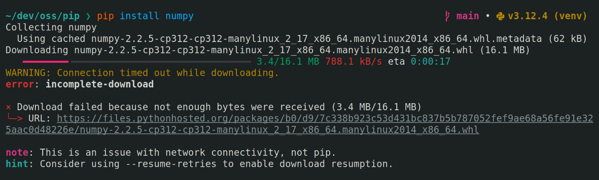

On April 26, 2025, we, the pip team released pip 25.1.

Compared to previous releases, this release is a large one. The [changelog] is quite long.
Among the changes, there are numerous new features, including an install progress bar and
support for [Dependency Groups]!

I won't cover every single change here, so as always, please refer to the changelog for
the full list of changes.

## Key features ✨

### Dependency groups (PEP 735)

Support for installing [Dependency Groups] (PEP 735) is now available with the `--group`
option.

> [!tip] What are Dependency Groups?
> [Dependency Groups] are the modern standardized replacement for requirements.txt files
> and extras used for development workflows. Dependency Groups are **NOT** published
> nor installable by the end user, unlike extras.
>
> They are meant to replace files like `test-requirements.txt` or extras like `[test]`,
> `[dev]`, or `[doc]`. They are defined in a `pyproject.toml` file under the
> `dependency-groups` table.[^separate-metadata]

First, let's assume there is a `pyproject.toml` file in the current directory that defines
`test` and `lint` dependency groups:

```toml
# pyproject.toml
[dependency-groups]
test = ["pytest", "pytest-xdist"]
lint = ["mypy", "isort"]
# Dependency Groups can include other groups! ✨
dev = [ {include-group = "test"}, {include-group = "lint"} ]
```

To install the `test` group, one can simply pass `--group test`.

```console {.command}
pip install --group test
```

You can repeat the option to install multiple groups. You can also use `--group` with
`-r`, `-e`, and any other dependency specifier. Want to install the local project,
two groups, and a requirements.txt? You bet you can.

```console {.command}
pip install . --group lint --group test -r my-old-requirements.txt
```

To install a dependency group from a `pyproject.toml` file that exists in a different
directory, state the path before the group separated with a colon.

```console {.command}
pip install --group ./dev/vem/pyproject.toml:dev
```

> [!warning]
> pip will **NOT** look in parent directories for a `pyproject.toml` file to
> install dependency groups from. pip does not have the concept of a project
> workflow.[^pip-project-model]
>
> Additionally, Dependency Groups are a standardized feature, thus pip-specific options
> are **NOT** supported. If you need to pass `--no-deps` or some other pip flag, you
> should continue to use a `requirements.txt` file.[^no-pip-specific-syntax]

Please read the [pip user guide for more information][pip-group-docs]. You can also read
the motivation and rationale sections of [PEP 735] if you are curious about why this
feature came about.

Thank you to [Stephen Rosen] for writing and shepherding PEP 735 and contributing the pip
implementation. Congratulations! 🎉

### Package installation progress bar

A progress bar has been added to `pip install` that tracks the installation
step.

<video controls loop>
  <source src="install-progress.webm">
</video>

Previously, pip would provide no feedback on how many packages have been installed. Is pip
slowly installing a large package (e.g., torch) or is pip simply stuck? Who knows! The
only time you do know is when pip first needs to uninstall an existing package to install
a new version, emitting `Attempting uninstall: mypackage` as it goes.

Now, you can install every single [Home Assistant] dependency and know much progress pip
has made after dependency resolution and downloads.

### Resumable downloads

Support for automatic download retrying is available as an experimental feature starting
with pip 25.1. The download retry limit can be configured using the `--resume-retries`
option.

> [!important]
> Download retrying (`--resume-retries`) is separate from *connection* retrying
> (`--retries`).

When a download terminates early, pip will attempt to resume the download from where it
left off. If the remote server does not support download resumption, pip will fall back to
restarting the download. If the download is still incomplete after pip has run out of
retries, a diagnostic error will be raised.



It has been a long-standing complaint that pip is unreliable on poor/flaky connections.
[Any downloads of a sufficiently large package would fail midway through][resume-issue],
forcing the user to retry the entire pip command, only for it to fail again. For users on
a slow or metered connection, pip is likely unusable. And if hash-checking was enabled,
then
[a confusing and misleading hash mismatch error would be raised][hash-mismatch-issue].

If you use the feature, **please let us know how it goes**! We want to make sure it works
well. Assuming nothing is fundamentally broken, `--resume-retries` will be changed in the
next release to allow a few download retries by default.

Thank you to [George Margaritis] for contributing this feature!

### Experimental lockfile (PEP 751) generation: `pip lock`

`pylock.toml` ([PEP 751]) is the recently accepted standard for Python lockfiles.
Lockfiles are alternatives to the classic `requirements.txt` format, designed to enable
reproducible installation in a Python environment.

pip 25.1 makes the first step at supporting the new lockfile format. [The `pip lock`
command][pip-lock] has been added to create a `pylock.toml` from a set of requirements.

Here's an example locking the pip project in editable mode and six.

```console {.command}
pip lock -e ./pip six --output - -qq
lock-version = "1.0"
created-by = "pip"

[[packages]]
name = "pip"

[packages.directory]
path = "pip"
editable = true

[[packages]]
name = "six"
version = "1.17.0"

[[packages.wheels]]
name = "six-1.17.0-py2.py3-none-any.whl"
url = "https://files.pythonhosted.org/packages/b7/ce/149a00dd41f10bc29e5921b496af8b574d8413afcd5e30dfa0ed46c2cc5e/six-1.17.0-py2.py3-none-any.whl"

[packages.wheels.hashes]
sha256 = "4721f391ed90541fddacab5acf947aa0d3dc7d27b2e1e8eda2be8970586c3274"
```

The produced lockfile is specific to the Python version and platform pip is invoked under.
In other words, the lockfile is **NOT** a universal lockfile.

The command is experimental, meant to enable basic locked installation scenarios. It is
expected to undergo further development once the lockfile standard sees more widespread
adoption and matures.

Installing *from* a lockfile is **unsupported**, but
[it is on the roadmap][installing-pylock].

Congratulations to [Brett Cannon] for getting a lockfile standardized after many years(!) of
PEP drafting and several rounds of discussion. I look forward to seeing `pylock.toml`
mature!

### `pip index versions` is stable

The `pip index versions` command is no longer experimental. It is the modern replacement
for the old `pip install mypackage==` hack which used to be an
[easy way to get the list of all available versions][no-version-hack].

```console {.command}
pip index versions six
six (1.17.0)
Available versions: 1.17.0, 1.16.0, 1.15.0, 1.14.0, 1.13.0, 1.12.0, 1.11.0, 1.10.0, 1.9.0, 1.8.0, 1.7.3, 1.7.2, 1.7.1, 1.7.0, 1.6.1, 1.6.0, 1.5.2, 1.5.1, 1.5.0, 1.4.1, 1.4.0, 1.3.0, 1.2.0, 1.1.0, 1.0.0, 0.9.2, 0.9.1, 0.9.0
  INSTALLED: 1.17.0
  LATEST:    1.17.0
```

In addition, you can now ask for JSON output using the `--json` flag.

```console {.command}
pip index versions six --json
{"name": "six", "versions": ["1.17.0", "1.16.0", "1.15.0", "1.14.0", "1.13.0", "1.12.0", "1.11.0", "1.10.0", "1.9.0", "1.8.0", "1.7.3", "1.7.2", "1.7.1", "1.7.0", "1.6.1", "1.6.0", "1.5.2", "1.5.1", "1.5.0", "1.4.1", "1.4.0", "1.3.0", "1.2.0", "1.1.0", "1.0.0", "0.9.2", "0.9.1", "0.9.0"], "latest": "1.17.0", "installed_version": "1.17.0"}
```

If you use `pip index versions` programmatically, you are encouraged to switch to the
`--json` output. Not only is it easier to parse, but you will avoid breakage if the
human-friendly format ever changes later.

Thank you to [Krishan Bhasin] for stabilizing `pip index versions` and adding JSON support!

## Key bugfixes

### Dependency resolution improvements

Dependency resolution is not my area of expertise, so I'm going to shamelessly steal the
changelog entries that [Damian Shaw] wrote:

- Speed up resolution by first *only* considering the "priorities" of candidates that must
  be required to complete the resolution.

- Improved heuristics for determining the order of dependency resolution by preferring
  direct URL candidates and requirements with upper bounds.[^upper-bounds]

- The upgrade to ResolveLib 1.1.0 fixes a known issue where pip
  [**would report a `ResolutionImpossible` error even though there is a valid solution**][backjump-bug].
  However, some very complex scenarios that previously resolved may resolve slower or fail
  with an `ResolutionTooDeep` error.

- The `ResolutionTooDeep` error has been converted into a more user-friendly diagnostic
  error. If you have any real-world examples that result in a `ResolutionTooDeep` error,
  [**we would like to hear them**][resolution-too-deep]!

### Legacy `.egg` distributions are only detected once

There are several formats that an installed package can be recorded in. Today, virtually
every package is installed using the [`.dist-info` format]. However, legacy
[`.egg` distributions] are still kicking around.

Support for `.egg` distributions has been deprecated since pip 23.2. In pip 25.1, this
deprecation was finalized... but wait, pip still supports `.egg` distributions! It turns
out that [`importlib.metadata`], the library used to discover installed packages on Python
3.11+, supports `.egg` distributions just fine.

This meant that `.egg` distributions were being discovered several times. The
`importlib.metadata` backend would find it, and then the [`pkg_resources`] backend,
leading to this confusing `pip list` output.

```console {.command}
pip list
Package                       Version
----------------------------- ---------------------
mypackage                     0.7.16
mypackage                     0.7.16
```

In pip 25.1, the `pkg_resources` backend is no longer used to discover `.egg`
distributions and this duplication will not occur. Warnings about the `.egg` deprecation
will no longer be printed.

## Deprecations & upcoming removals

Starting with this release, the pip project no longer supports Python 3.8.

In addition, here is a list of current deprecations and the release they will be removed.
As always, any given removal may be **pushed to a future release as needed**.

Non-bare project name in egg fragment *To be removed in pip 25.2*
: [See the pip 25.0 post for more details.][old-deprecations]

Legacy setup.py editable installs *To be removed in pip 25.3*
: Please read [the deprecation issue for more details and advice][#11457]. This was
  scheduled for removal in 25.0 and then 25.1, but it got pushed back (again) to coincide
  with the deprecation of `setup.py bdist_wheel` installs.

Legacy setup.py `bdist_wheel` installs *To be removed in pip 25.3*
: Please read [the deprecation issue for more details and advice][bdist_wheel], however,
  the summary is that pip will stop running `setup.py bdist_wheel` directly to build a
  wheel for installation. This is a compatibility fallback for old environments that do
  not support the modern PEP 517 interface.

Non-standard wheel filenames *To be removed in pip 25.3*
: This is a continuation of the old deprecation as the original deprecation did not catch
  all non-standard wheel filenames.
  [See the pip 25.0 post for more details.][old-deprecations]

## Acknowledgements

Thank you to Damian Shaw, Emma Smith, Hugo van Kemenade, and Stéphane Bidoul reviewing the
draft of this post. Any typos or glaring mistakes are my own.

[^separate-metadata]: They are not defined under the `project` table because Dependency Groups
    are meant to be a general feature that work regardless of whether you have an actual Python
    package to install or not.

[^pip-project-model]: There has been extensive discussion about pip's fundamental design
    and whether it should change. There is too much to easily summarize, but broadly, pip
    has always been designed as a package manager, and *not* as a *project* workflow tool.
    There are many other tools that compete in the project management space. The consensus
    during review is that pip is valuable as a foundational tool that simply manages your
    installed Python packages and does what you want without too much fuss. More practically,
    shifting to a project-based model would constitute a major redesign of the pip UI and UX.

[^no-pip-specific-syntax]: This is a limitation of the specification. However, if sufficient
    consensus builds around certain tool-specific flags, they can be standardized so they
    can be included in Dependency Groups in the future.

[^upper-bounds]: Please don't add upper bounds **unless** you know for a fact your codebase is
    incompatible with the newer versions. Pre-emptive upper-bounds will not help
    dependency resolution and [are generally considered harmful][upper-bounds].

[#11457]: https://github.com/pypa/pip/issues/11457
[backjump-bug]: https://github.com/pypa/pip/issues/12317
[bdist_wheel]: https://github.com/pypa/pip/issues/6334
[brett cannon]: https://github.com/brettcannon
[changelog]: https://pip.pypa.io/en/latest/news/#v25-1
[dependency groups]: https://packaging.python.org/en/latest/specifications/dependency-groups/
[damian shaw]: https://github.com/notatallshaw
[george margaritis]: https://github.com/gmargaritis
[hash-mismatch-issue]: https://github.com/pypa/pip/issues/11153
[home assistant]: https://github.com/home-assistant/core/blob/dev/requirements_all.txt
[installing-pylock]: https://github.com/pypa/pip/issues/13334
[krishan bhasin]: https://github.com/KrishanBhasin
[no-version-hack]: https://github.com/pypa/pip/issues/12852
[old-deprecations]: /blog/2025/01/whats-new-in-pip-25.0/#upcoming-removals
[pep 735]: https://peps.python.org/pep-0735/
[pep 751]: https://peps.python.org/pep-0751/
[pip-group-docs]: https://pip.pypa.io/en/latest/user_guide/#dependency-groups
[pip-lock]: https://pip.pypa.io/en/latest/cli/pip_lock/
[resolution-too-deep]: https://github.com/pypa/pip/issues/13281
[resume-issue]: https://github.com/pypa/pip/issues/4796
[stephen rosen]: https://github.com/sirosen
[upper-bounds]: https://iscinumpy.dev/post/bound-version-constraints/
[`.dist-info` format]: https://packaging.python.org/en/latest/specifications/recording-installed-packages/
[`.egg` distributions]: https://setuptools.pypa.io/en/latest/deprecated/python_eggs.html
[`importlib.metadata`]: https://docs.python.org/3/library/importlib.metadata.html
[`pkg_resources`]: https://setuptools.pypa.io/en/latest/pkg_resources.html
