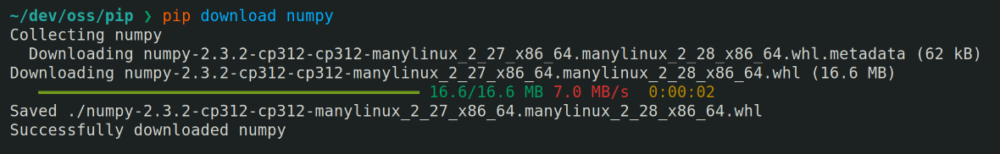
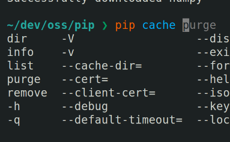

On July 30, 2025, we, the pip team [released pip 25.2][dpo].

Relative to the large 25.1 release, this release is tiny. It's honestly so small that it
barely warrants a post, but it wouldn't be a proper release without a post, so enjoy
whatever this is.

As always, please [consult the changelog][changelog] to learn about all of the changes
contained in this release.

## Key changes

- Python 3.14 is now supported, with fixes to file URL/path handling included.[^url-hell]

- Automatic download resumption is now stable and enabled by default.🎉

  - By default, pip will resume a download up to five times. If more attempts are desired,
    you may configure a higher limit with `--resume-retries`.

  - In addition, caching support was added to resumed downloads so pip does not need to
    redownload files as expected.

- The download ETA is replaced by the elapsed time once the download has completed. While
  `ETA 0:00:00` is technically correct, it is not useful information 😉



- The truststore and proxy features can be used together without conflicting with each
  other.

- Sub-commands are included in TAB completion.



## Deprecations & upcoming removals

Here's the current list of current deprecations with the release in which they are
scheduled for removal. As always, any given removal may be **pushed to a future release as
needed**.

Non-bare project name in egg fragment *To be removed in pip 25.3*
: [See the pip 25.0 post for more details.][old-deprecations] This got pushed to pip 25.3
  as the support for the Direct URL syntax for installing editable VCS projects did not
  land in this release, sadly.

Legacy setup.py editable installs *To be removed in pip 25.3*
: Please read [the deprecation issue for more details and advice][#11457]. This was
  scheduled for removal in 25.0 and then 25.1, but it got pushed back (again) to coincide
  with the deprecation of `setup.py bdist_wheel` installs.

Legacy setup.py `bdist_wheel` installs *To be removed in pip 25.3*
: Please read [the deprecation issue for more details and advice][bdist_wheel], however,
  the summary is that pip will stop running `setup.py bdist_wheel` directly to build a
  wheel for installation. This is a compatibility fallback for old environments that do
  not support the modern PEP 517 interface.

Non-standard wheel filenames *To be removed in pip 25.3*
: This is a continuation of the old deprecation as the original deprecation did not catch
  all non-standard wheel filenames.
  [See the pip 25.0 post for more details.][old-deprecations]

## Sneak peek: in-process build dependencies

Since this release post is so small, I thought I'd take the time to share what I've been
working on in addition to my typical maintainer duties.

If you've ever installed a project from source, you've likely noticed that pip takes a
while to build the project.

```console { .command }
time pip install ./dev/oss/pip
Processing /home/ichard26/dev/oss/pip
  Installing build dependencies ... done
  Getting requirements to build wheel ... done
  Preparing metadata (pyproject.toml) ... done
Building wheels for collected packages: pip
  Building wheel for pip (pyproject.toml) ... done
  Created wheel for pip: filename=pip-25.2.dev0-py3-none-any.whl size=1856601 sha256=8d02c1146bbeaa023421ac298240575fc2e96400ac3a7f86209426a8254dc0f8
  Stored in directory: /tmp-ram/pip-ephem-wheel-cache-4ctznmto/wheels/de/a6/21/441242ad27acc3bddc1079ff202cc70bad47d31432987f2bf0
Successfully built pip
Installing collected packages: pip
Successfully installed pip-25.2.dev0

real   0m2.986s
user   0m2.132s
sys    0m0.527s
```

While pip is generally _not_ fast, **PEP 517 builds**—which is the modern/default
mechanism for building projects—are particularly heavy. If I disable PEP 517 processing
and force pip to use the _legacy_ setuptools-specific build mechanism, the install is
noticeably faster.

```console { .command }
time pip install ./dev/oss/pip --no-use-pep517
[...]

real   0m1.919s
user   0m1.486s
sys    0m0.413s
```

The overhead of PEP 517 processing comes from two main sources:

- **The PEP 517 interface itself.** To build a project in the PEP 517 way, pip must call
  Python hooks provided by the configured build backend. For example, PEP 517 backends
  must supply a `build_wheel` function which when called builds the project and returns
  the path to the resultant wheel. All of these calls are mandated to occur in fresh
  subprocesses which each incur a Python startup/shutdown penalty. Yikes!

- **Build isolation.** In PEP 517 mode, pip by default sets up a temporary isolated
  environment to perform the build in. The build backend and any additional build
  dependencies are installed to this temporary environment on the fly.

In practice, pip has to call effectively the same hooks even under the legacy mechanism so
the design is not actually any slower.[^floor] **The additional overhead is from build
isolation**. Creating the temporary environment is cheap, but installing build
dependencies is very much _not_.

A major part of the install time is spent on _accessing the network_. Yes, pip is checking
PyPI (or the configured index) to determine the most up to date versions of build
dependencies every time it sets up a build environment. This is why building from source
often requires active Internet access with modern pip.[^offline-support]

However, another major source of the overhead is from **invoking a pip in a subprocess**
to install build dependencies. Large Python applications are rather slow to start up and
pip is no exception. For example, `pip install --help` takes ~220ms to execute on my
system.

Starting a new pip process also comes with other cons, including numerous bugs related to
configuration not being passed down and abysmal error reporting.

Consequently,
[we've wanted to replace this mechanism and switch to installing build dependencies within the same root pip process for years][dreams].

The good news is that **this work is finally starting to happen!**

[I've published a draft PR][inprocess-draft] that would add an alternative mechanism which
installs build dependencies in-process. There will be behavioural differences compared to
the current subprocess installation method, but those will be covered in a future post
when the feature is generally available for testing. The good news is that it is already
**demonstrating performance improvements**.

```console { .command }
time pip install . --use-feature=inprocess-build-deps
[...]

real   0m2.672s
user   0m1.836s
sys    0m0.483s
```

In comparison with the initial example, 300ms has been saved which is in line with the
startup overhead of the `pip install` command.[^additional-overhead] The configuration
inheritance story related to build dependencies will be cleaned up as part of this effort,
too.

There remains considerable work (notably around error handling and adding more tests)
before the PR is ready for review, but if everything goes to plan, it _should_ be
**available in pip 25.3 as an experimental feature**.

[^url-hell]: Well, it *should* be supported, anyway. There were *lots* of test failures on Python
    3.14 due to URL\<->path conversion issues. They were caused by a mix of upstream
    changes in `pathname2url()` and `url2pathname()` and then undiscovered bugs in pip's
    URL\<->path utilities. It was hell, and frankly, I'm not 100% sure everything is right
    as I am barely an expert on file URLs (even after reading RFCs for an hour).

[^floor]: Although the design does serve to limit the lowest achievable build times even with
    well-optimized tools like uv.

[^offline-support]: [We recognize that it'd be nice if pip supported an offline mode][offline-issue] where
    pip fell back to using whatever packages were already stored in the HTTP or wheel
    caches, but unfortunately, this would require a major refactoring of the caching
    stack. If you'd like to help us out and suggest a proposal that's feasible with the
    limited resources the pip project has, you are more than welcome to do so.

[^additional-overhead]: Remember that there is even more overhead beyond initial import times. A new pip
    process also needs to configure the network stack (which can be quite slow on some
    systems), load configuration, and shut down properly.

[#11457]: https://github.com/pypa/pip/issues/11457
[bdist_wheel]: https://github.com/pypa/pip/issues/6334
[changelog]: https://pip.pypa.io/en/latest/news/#v25-2
[dpo]: https://discuss.python.org/t/announcement-pip-25-2-release/100716
[dreams]: https://github.com/pypa/pip/issues/9081
[inprocess-draft]: https://github.com/pypa/pip/pull/13450
[offline-issue]: https://github.com/pypa/pip/issues/8057
[old-deprecations]: /blog/2025/01/whats-new-in-pip-25.0/#upcoming-removals
