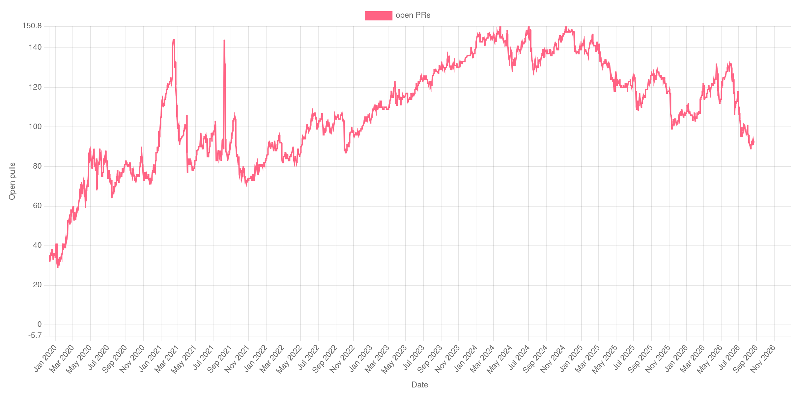
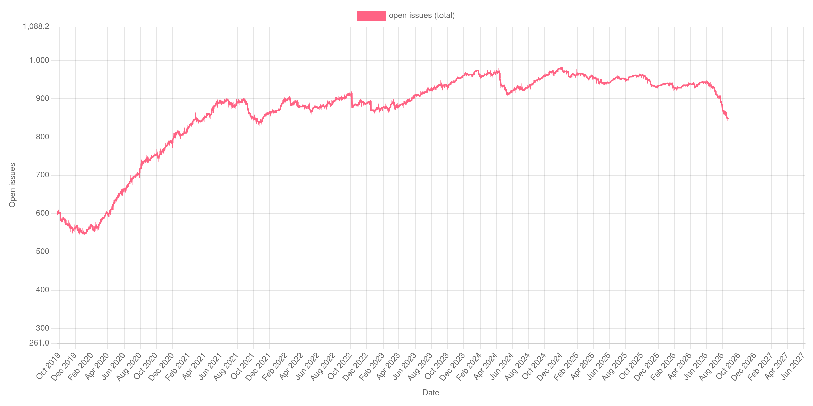

As I announced in a previous post, [the pip project secured funding to have me
work on pip on a part-time basis from June to August this year](/blog/2026/06/pip-contract-development/).

The contract period is now finished, so it's time to look at what was delivered, what work
remains, and the reflections I have.

Beforehand, though, I'd like to express my greatest apprecation for the Python Software
Foundation, the Packaging Workgroup, and my pip co-maintainers for their trust and this
opportunity! It has been an opportunity like no other.

## What was delivered

### Virtual environment build isolation

This was my first work item, and I'm happy to say that `--use-feature=venv-isolation`
was shipped in pip 26.2. The feature was [quite a bit more complicated] than I was
expecting -- especially since I did have a working prototype for *years* -- but I'm
so glad it exists now.

Python 3.15 broke our current build isolation mechanism, and [the fix we implemented]
has had [unintended consequences]. It's getting increasingly difficult to patch
all of the ways our heavy-handed isolation mechanism behaves poorly, so I'm
looking forward to replacing it with `venv-isolation`.

In particular, it feels good that `--use-feature=venv-isolation` is a solution
for the linked issue.

### Deprecation of legacy resolver

Some, albeit limited progress has been made on fully deprecating the legacy resolver.

Pradyun's fixes for a handful of long-standing bugs of the resolvelib resolver were
included in pip 26.2 (without issue). Furthermore, I have prepared language to use when
we will be communicating the legacy resolver removal more broadly.

The last blocker is whether and how to support Direct URLs dependencies satisfying
editable requirements to equivalent locations. There have been four related PRs
([#1][r1] [#2][r2] [#3][r3] [#4][r4]), and work is still on-going as the feature may
possibly expand to prioritizing editable requirements over equivalent direct URL
requirements generally and supporting editable constraints.

These features are heavily intertwined and involve nontrivial changes to the resolver,
so I expect these to take a while.

The upside is that I did familiarize myself with pip's resolver code (which was a
secondary goal). I feel more ready to take on the removal of the legacy resolver whenever
it does occur.

### Error improvements

In June, I shipped [new diagnostic errors for HTTP connection errors][http errors] that are easier
to read and provide useful advice to the user.

Later, I took a brief detour to [fix an uncaught exception when the build backend failed to
be imported][backend import error]. Afterwards, I soon filed
[a draft PR to rewrite urllib3 retry warnings to be understandable][urllib3 retry warning]
after reaching a compromise with the urllib3 maintainers. Once upstream changes to urllib3
are released, the HTTP retry warning will be concise and informative.

```
$ pip install https://expired.badssl.com --retries 3 --timeout 3
```

```
Collecting https://expired.badssl.com
  WARNING: SSL verification failed while connecting to expired.badssl.com, retrying 3 more times
  WARNING: SSL verification failed while connecting to expired.badssl.com, retrying 2 more times
  WARNING: SSL verification failed while connecting to expired.badssl.com, retrying 1 last time
error: ssl-verification-failed

× Failed to establish a secure connection to expired.badssl.com while fetching https://expired.badssl.com/
╰─> [SSL: CERTIFICATE_VERIFY_FAILED] certificate verify failed: certificate has expired (_ssl.c:1081)

hint: You may need to use --cert or check your proxy/firewall configuration
```

Near the end, I filed a
[PR for improving "this wheel is incompatible with this platform" errors][wheel incompatible error].

```
$ pip install numpy-2.5.0-cp314-cp314t-manylinux_2_27_aarch64.manylinux_2_28_aarch64.whl --dry-run
```

```
error: incompatible-wheel

× numpy-2.5.0-cp314-cp314t-manylinux_2_27_aarch64.manylinux_2_28_aarch64.whl is incompatible
╰─> Wheel architecture is unsupported: aarch64 (current: x86_64)

hint: Run 'pip debug -v' for a list of compatible tags for your system.
```

### Index priority (or not)

I ended up removing index priority as one of my working items. [I left a detailed explanation
on why in one of my updates][explanation], but the TL;DR is that index priority is a huge
feature *and* minefield. I was hoping that there would be a viable way to implement a simple
form of index priority that would be beneficial, but after further discussions, there was not.

In light of that, I decided to instead work on improving and ensuring full compatibility of
`--use-feature=inprocess-build-deps` with the `venv-isolation`. [In-process build dependencies]
is an experimental feature that I shipped earlier in the year (before this grant work). It works
great, and like `venv-isolation`, will fix many long-standing issues. However, it was stuck in
limbo since IMO it wasn't quite ready to be enabled by default (especially after realizing it
was mildly incompatible with `venv-isolation`). In interest of avoiding features being stuck
in experimental limbo forever, I decided improving `inprocess-build-deps` was the next best
thing to do.

I know this is disappointing since index priority is one of the features that
many people would welcome and appreciate. I'm sorry. It's just that it's better to get index
priority right over rushing.

### General maintenance

I've made good progress here, having decided that focusing on code review was the best use
of my time.[^2] In total, I reviewed 93 pull requests, resulting in
[pip 26.2](/blog/2026/07/whats-new-in-pip-26.2/) being a massive release with many
features and bugfixes.

I'm also happy to report that the open PR backlog sits at around 90, down from 130 when I
first started working in June.



Whenever I got bored, I closed stale or already resolved issues in pip's issue tracker.[^3]



Overall, the net change in open issues since end of May is around -92. 🎉

Our new triagers, Sepehr Rasouli and Youngkwang Yang, have done the majority of the
leg work here, however. Without them, the drop in the past three months would've been far
more muted.

Finally, on the note of new triagers, I've spent some time during these months
reviewing and providing support to our newest members of the pip team. While this wasn't
a part of the original goals, I fully believe investing in future contributors. It's the
only way pip can be maintained for the long-term.

## What work remains

- Further work on improving `inprocess-build-deps` and compatibility between it and
  `venv-isolation`. [A PR to replace our spinners is the first part.][spinner pr] I have
  a work-in-progress PR to address bugs and limitations of the in-process build dependency
  installer, and I'm planning to follow up with more tests.

- Fixing the last technical blocker for the deprecation of the legacy resolver and scheduling
  a removal date. This is likely to occur on a timescale of quarters, contingent on when a pip
  maintainer (probably me) has significant free time to volunteer.

- Further work on improving "no distribution found" resolver errors. I did take a look here,
  even prototyping an improvement when `requires-python` prevents a distribution from being
  found, but I quickly realized that making improvements here is highly nontrivial.[^4] For now,
  I plan on shipping small incremental improvements where possible.

- Reviewing and shepherding the [index error improvement] and [invalid distribution metadata] PRs
  that triager Sepehr Rasouli has submitted. They are nontrivial changes, but they offer a
  meaningful improvement to UX.

- Addressing feedback on and landing my current open PRs :)

## Reflections

- **I was way overly optimistic with my assumptions on how much work I could accomplish.**
  In hindsight, I should've scaled down my expectations. Underpromise and overdeliver, really.
  For what it's worth, this is my first real job in the software industry, so this is a
  professional lesson learned.[^1]

- **There is never enough time for PR review.** I spent a huge portion of my time reviewing
  PRs in the month or so before release 26.2, and yet it feels like I hardly made a dent.
  Regardless, it was extremely beneficial to have dedicated time for review because it's often
  the most time consuming and difficult part of being a maintainer. Not only do you need the
  technical skill and codebase expertise, but doing code review right is also a social skill,
  especially when giving feedback to regular contributors.

  - This was also an issue for me since I've been waiting for some time to have my work
    reviewed (or in some instances, not reviewed). There were intentions to have more maintainer
    time for review during this period, but through the happenstances of life, that time never
    materialized.

- **OSS maintenance is a job in itself.** Continuing from the previous point, OSS maintenance
  is a lot of work. It's not even the amount of work, but the type of work if you want to do
  it "properly". There are simply parts of the work that I don't enjoy (as much) or require lots
  of social/mental energy, of which I have in limited quantities. I've known this for many
  years, having maintained Black in a previous life, but I didn't internalise just how much
  of a job it really is until I was paid for this work.

[^1]: Truthfully, this is a tad embarrassing to admit, but I promised that I'd publish any reflections
  openly. In addition, it is a running joke in the software industry that time estimates are never right,
  so that does bring me some comfort.

[^2]: In particular, we've had very limited maintainer time available for review for ages now. I
  was by far the most active reviewer in the these few past months.

[^3]: Which is, fun fact, how I became a pip triager! (and thus kickstarting my journey to becoming
  a pip maintainer) The dip in open issues in early 2024 was largely my doing!

[^4]: The complexity lies in determining with complete confidence what caused "no distributions found"
  for a specific package. pip's package finder rejects distributions on a fail fast basis, so even if
  a distribution was rejected for "requiring an incompatible Python version," it doesn't mean that
  if the Python version incompatibility went away, the distribution would suddenly be a viable choice
  (it could be rejected for further reasons, but we don't know). A distribution can be rejected for
  many reasons -- `requires-python`, wheel compatibility tags, wheel vs sdist format restrictions, etc. --
  making it quite difficult to pin down a single reason. The easy cases aren't too bad to deal with,
  but the false positives in the complex cases are the last thing you want when printing specialized
  errors, lest you point the user down a rabbit down that leads to nowhere.

[quite a bit more complicated]: https://github.com/pypa/pip/pull/14070
[r1]: https://github.com/pypa/pip/pull/13888
[r2]: https://github.com/pypa/pip/pull/13904
[r3]: https://github.com/pypa/pip/pull/14101
[r4]: https://github.com/pypa/pip/pull/14195
[http errors]: https://github.com/pypa/pip/pull/14115
[backend import error]: https://github.com/pypa/pip/pull/14218
[urllib3 retry warning]: https://github.com/pypa/pip/pull/14242
[wheel incompatible error]: https://github.com/pypa/pip/pull/14281
[explanation]: https://github.com/pypa/pip/issues/14025#issuecomment-5229783023
[the fix we implemented]: https://github.com/pypa/pip/pull/14033
[unintended consequences]: https://github.com/pypa/pip/issues/14278
[in-process build dependencies]: /blog/2025/07/whats-new-in-pip-25.2/#sneak-peek-in-process-build-dependencies
[spinner pr]: https://github.com/pypa/pip/pull/14238
[index error improvement]: https://github.com/pypa/pip/pull/13971
[invalid distribution metadata]: https://github.com/pypa/pip/pull/14219
